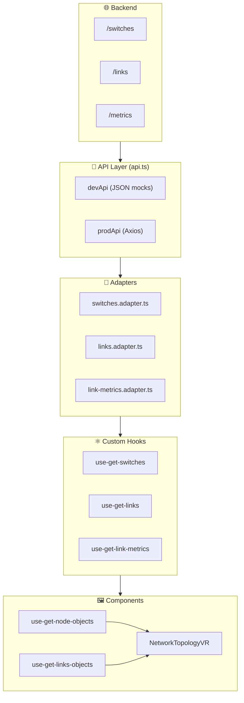

# 🌐 Network Topology VR Viewer

This project is a **VR network topology visualization tool** built with **React** and **Vite**.

It renders switches, links, and metrics in a VR environment, making it easier to analyze and interact with complex network infrastructures.

---

## 🚀 Features

- **VR Network Topology** – Interactive visualization of switches and links in a VR space.
- **Data Abstraction with Adapters** – Clean separation between backend and frontend domain models.
- **Mocked & Real Data** – Works with both local JSON data and API endpoints via Axios.
- **Custom Textures** – Dynamic table and metrics rendering on VR objects.
- **Hooks-based Data Layer** – Custom React hooks for fetching and managing network data.

---

## 📂 Project Main Structure

```
src
 ┣ 📂 api/                # Data layer: adapters, axios instance, types, mock data
 ┣ 📂 components/         # UI components (VR network topology visualization)
 ┣ 📂 config/             # Environment Config Variables
 ┣ 📂 constants/          # Shared constants (e.g., colors)
 ┣ 📂 helpers/            # Utility functions
 ┣ 📂 hooks/              # Custom hooks for fetching switches, links, and metrics
 ┣ 📂 lib/                # Low-level libraries utilities for canvas and texture rendering
 ┣ 📂 pages/              # Application pages
 ┣ 📜 app.tsx             # Root application component
 ┣ 📜 main.tsx            # Entry point
 ┣ 📜 index.css           # Global styles
```

---

## 🛠️ Tech Stack

| Technology               | Version | Purpose                 |
| ------------------------ | ------- | ----------------------- |
| **React**                | ^19.1.0 | Core UI library         |
| **Vite**                 | ^6.3.5  | Bundler and dev server  |
| **TypeScript**           | ~5.8.3  | Static typing           |
| **Axios**                | ^1.11.0 | HTTP client             |
| **TanStack Query**       | ^5.85.5 | Server state management |
| **Three.js**             | ^0.173  | 3D rendering            |
| **react-force-graph-vr** | ^2.1.0  | VR graph support        |
| **TailwindCSS**          | ^4.1.12 | Utility-first styling   |
| **ESLint**               | ^9.25.0 | Code linting            |
| **Prettier**             | 3.6.2   | Code formatting         |


---

## ⚙️ Setup & Installation

1. **Clone the repository**
   ```bash
   git clone https://github.com/JorgeAVargasC/react-3d-models
   ```

2. **Navigate to the project directory**

   ```bash
   cd react-3d-models
   ```

3. **Install dependencies**
   ```bash
   npm install
   ```

---

## 📜 Commands

| Command           | Description                                                      |
| ----------------- | ---------------------------------------------------------------- |
| `npm run dev`     | Start the development server with Vite.                          |
| `npm run build`   | Type-check with TypeScript and build the project for production. |
| `npm run preview` | Preview the production build locally.                            |
| `npm run lint`    | Run ESLint to analyze and fix code quality issues.               |
| `npm run format`  | Format the entire codebase with Prettier.                        |

---

## 📡 API & Data Flow

1. **API / Mock Data** (JSON or backend service)
2. **Adapters** – Convert raw backend data into frontend models, if backend changes, only the adapters need to change
3. **Hooks** – Handle fetching, caching, and state with Tanstack Query
4. **Components** – Render the network topology



---

## 📌 Future Improvements

- Real-time updates with WebSockets

---

## 📄 License

This project is licensed under the **MIT License**.


---

# Examples

## Adapters

### Switches Adapter

```ts
const switchesAdapter: (switches: ISwitch[]) => ISwitchDTO[]
```

###### ISwitch[]
```json
[
  {
    "switches": {
      "puerto3_numero": {
        "low": 3,
        "high": 0
      },
      "puerto2_dpid": "s6-eth2",
      "port0_status": "DOWN",
      "port3_status": "UP",
      "port1_status": "UP",
      "port2_status": "UP",
      "puerto0_numero": {
        "low": -2,
        "high": 0
      },
      "puerto1_dpid": "s6-eth1",
      "switch_dpid": {
        "low": 6,
        "high": 0
      },
      "puerto2_numero": {
        "low": 2,
        "high": 0
      },
      "puerto1_numero": {
        "low": 1,
        "high": 0
      },
      "puerto0_dpid": "s6",
      "puerto3_dpid": "s6-eth3"
    }
  }
]
```

###### ISwitchDTO[]
```json
[
  {
    "switchId": 6,
    "name": "s6",
    "ports": [
      {
        "label": "Port 0",
        "isActive": false,
        "dpid": "s6",
        "number": -2
      },
      {
        "label": "Port 1",
        "isActive": true,
        "dpid": "s6-eth1",
        "number": 1
      },
      {
        "label": "Port 2",
        "isActive": true,
        "dpid": "s6-eth2",
        "number": 2
      },
      {
        "label": "Port 3",
        "isActive": true,
        "dpid": "s6-eth3",
        "number": 3
      }
    ],
    "switchPort": 6
  }
]
```


